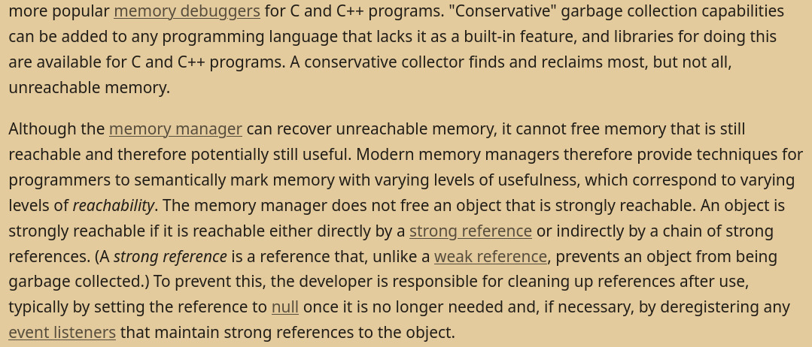

# Faults, Errors & Bugs

> [!NOTE]
> This section of the notes is short and will need to recieve extensive additions in the future

While most kinds of errors are easily discernible (syntax errors, type errors, segfaults and out-of-bounds access, etc..) there are some that are still worth noting here. 

#### Undefined Behaviour (UB)
Happens when the language gives no defined outcome for the syntax you're using. For example: 
###### - Signed overflow: 
occurs when an arithmetic operation on signed ints results in a value that is outside the range of values the specific data type can represent.
###### - Data races: 
A data race happens when 2 instrucs from different threads access the same mem location, at least one of these accesses is a write, and there is no
syncing that is enforcing any particular order among these accesses. This is not to be confused with race conditions, which are semantic errors, and happen 
when the timing/ordering of events in the program leads to erroneous behaviour, that is not *necessarily* due to a data race. 

###### STACK OVERFLOW 
because every time you call a function that takes args of size N bytes, N bytes are allocated on the stack. So if a function calls itself infinitely, you'll keep allocating N bytes
until the stack is exhausted. Happens with infinite recursion for example. 

#### Memory Leak 
Some possible causes:
    - A program runs for a long time and consumes added memory over time, such as background tasks on servers, and especially in embedded systems which may be left running for many years
    - New memory is allocated frequently for one-time tasks, such as when rendering the frames of a computer game or animated video
    - A program can request memory, such as shared memory, that is not released, even when the program terminates
    - A system device driver causes a leak

^ [wikipedia](https://en.wikipedia.org/wiki/Memory_leak)
