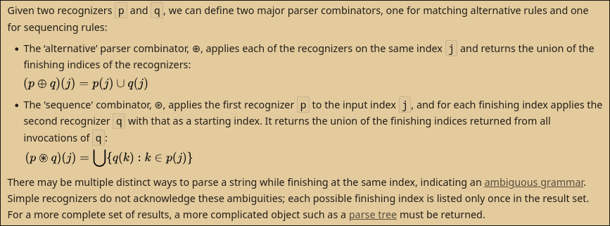
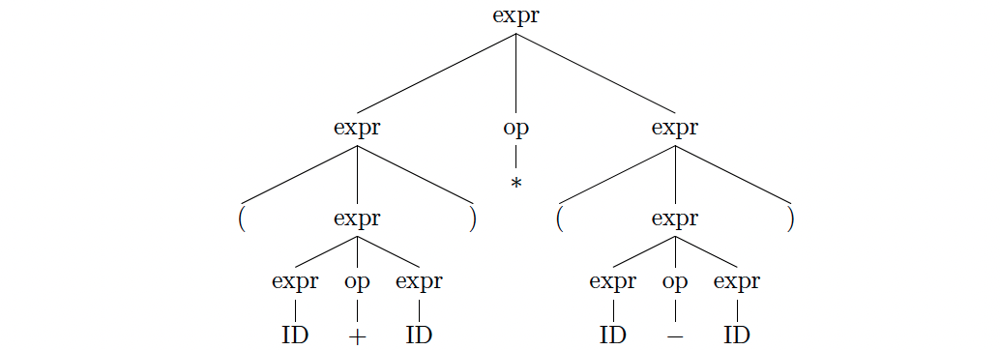

### Parser combinators
A parser is a function that takes a raw input sequence and returns meaningful info built from that sequence, or detects errors if the input is not as expected.
As such, a parser combinator accepts several parsers as input, and returns a new parser as its output.

> "In this context, a parser is a function accepting strings as input and returning some structure as output, typically a parse tree or a set of indices representing locations in the string where parsing stopped successfully. Parser combinators enable a recursive descent parsing strategy that facilitates modular piecewise construction and testing. This parsing technique is called combinatory parsing."

##### Shortcomings: 
- Naïve versions run in exponential time on ambiguous grammars.
- Standard recursive-descent combinators cannot handle left recursion (infinite loops).
- Ambiguities are discovered only at runtime, not at grammar-design time.

> [!NOTE]
> "These could often be solved through memoization, Monadic parsing, or Left-recursion–friendly algorithms (Frost, Hafiz, Callaghan)."
> I need to research these ^

##### Matching Alternative Rules & Sequencing Rules 

^ [wikipedia](https://en.wikipedia.org/wiki/Parser_combinator)
##### Parse tree 
A parse tree is a rooted, ordered tree that visually represents the syntactic structure of a string based on a formal grammar.
It shows how a string is derived from a start symbol, with internal nodes representing non-terminal symbols and leaves
representing the terminal symbols (tokens) of the string

> [!NOTE]
> Research this ^ more extensively

### Parser generator, "compiler-compiler" or compiler generator 
> "In computer science, a "compiler-compiler" or compiler generator is a programming tool that creates a parser, interpreter,
or compiler from some formal description of a programming lang. The most common type of "compiler-compiler" is called 
a *parser generator*. It handles syntactic analysis only.
> 
> A formal description of a lang is usually a grammar used as an input to a parser generator. It often resembles BNF (Backus–Naur form), 
extended BNF, or has its own syntax. Grammar files describe a syntax of a generated compiler's target programming lang and actions 
that should be taken against its specific constructs."
